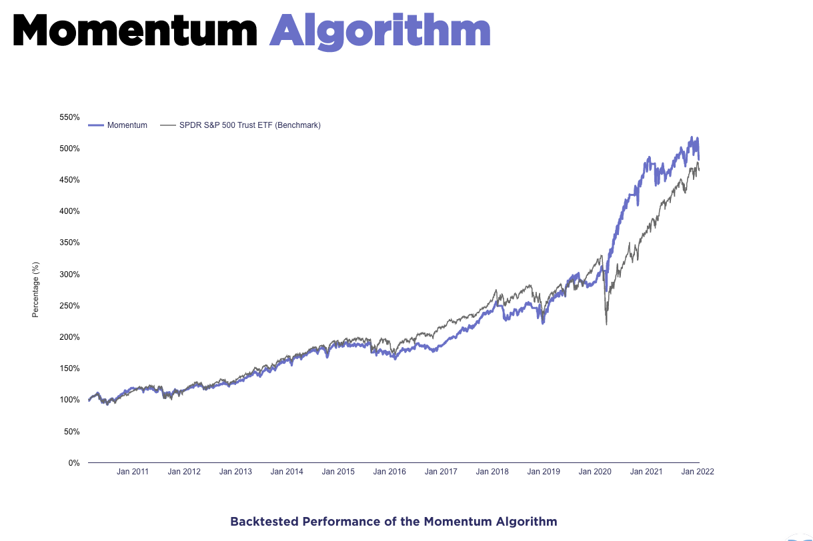
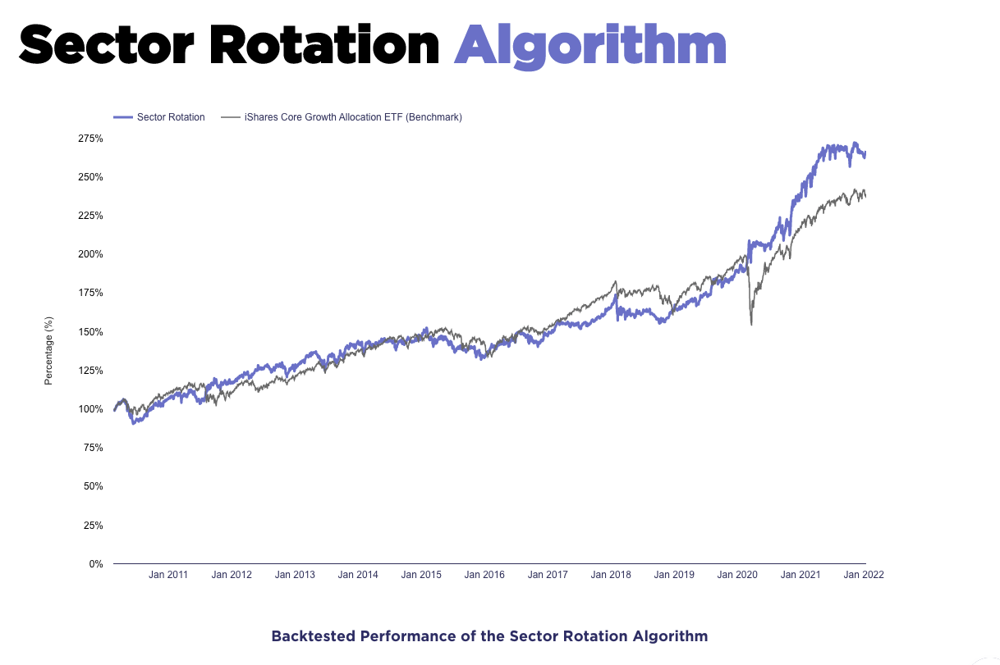
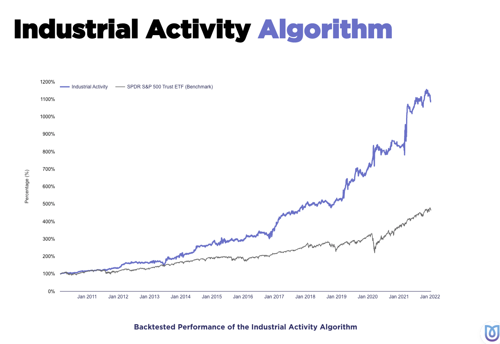
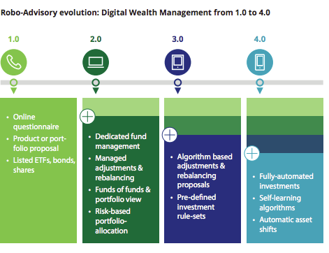

# Unit-1-Homework-Assignment
----
## Fintech Case Study

---
### Overview and Origin
---
* Name of company
  * Unhedged


* When was the company incorporated?
  * Unhedged was founded in 2020 


* Who are the founders of the company?
   * Peter Bakker is a former Google sales and director of operations manager and Mike Cohen, a former Macquarie and KPMG employee, wanted to revamp the newly emerging online investment advice market, which they criticise of charging fees for little service. They brought there many years of skill together to start Unhedged.


* How did the idea for the company (or project) come about?
   * They came up with the idea to start Unhedged because they saw many people coming into the market and who have tried platforms like Robinhood and Superhero have learned that trading is not as simple as it appears. They found that people aren't seeing their portfolios perform as well as they would want and, in some cases, bring no returns. Bakker also claims that the entire market system is "rigged" against the retail investors. Also saying “This industry is broken and needs to be disrupted". This is the fundamental reason that Unhedged was started. To bring more power into the hands of the ordinary investor and even the playing field.


* How is the company funded? How much funding have they received?

   * Unhedged started a pre-seed and managed to raise 500,00 from it in November 2020.
As word got out about Unhedged they stared to received more funding. Receiving $10,000 from Littlebanc Advisors LLC. and Palm Ventures respectably then the biggest capital raise they did would come in June 2021 being 2.3mil from equity crowdfunding. In this there were big names like original investors in Zip.


---
### Business Activities:
---
* What specific financial problem is the company or project trying to solve?
   * There are a few funds in Australia that employ algorithmic trading, but they are mainly exclusively open to the top 1%. As a result, people who are already well-off get even wealthier. Unhedged objective is to provide equitable wealth opportunities for everybody. "Both the rich and the less fortunate should have access to the same sophisticated financial products," Bakker says. The major disadvantage of typical trading platforms is the difficulty in obtaining excellent profits. What a trading platform does not do effectively is assist you in developing a strategy and this is what Unhedged is trying to solve with their AI algorithms. By automating the trading Unhedged is solving the age-old problem of poor returns to the retail trader.

* Who is the company's intended customer?  Is there any information about the market size of
this set of customers? What solution does this company offer that their competitors do not or cannot offer? (What is the unfair advantage they utilize?)
   * Unhedged states that everyone can have a piece of the financial action with the minimum being $100 minimum to get started. This is because the pair is first targeting Gen X, Millennial, and Gen Z investors who are frustrated with existing robo-advisers' index-like results or who are trying to beat the market using DIY trading applications. On top of that, they don’t take transaction costs unlike competitors but go with a different two fee structure. Being an Asset Management fee and a Pay for Success cost. They only take a fee if your portfolio increases and they outperform the benchmark if not no fees are due. This makes the barrier to use Unhedged low as younger investors get turned off by fees as they usually have little capital to invest to start with.


* Which technologies are they currently using, and how are they implementing them? (This may
take a little bit of sleuthing–– you may want to search the company’s engineering blog or use
sites like Stackshare to find this information.)

   * They are currently using Ai algorithms and currently there are three running and the first is the momentum algorithm
```python
```
  * 
  * The momentum algorithm trades with the highest "Modified Dupont ROE. The Modified Dupont ROE is a customised indicator that analyses the health of stocks based on their Return on Equity while taking the capital structure of the firm into account. This specific algorithm uses stocks that have a daily dollar volume of USD 10 million or more on average during the last 30 days. The companies trade must also have market capitalisation must be at least $500 million USD for liquidity preposes. Internal Mechanisms of the Momentum Algorithm are comprised of the data of thousands of companies that are chosen and choose the best based on basic considerations. Then it identifies businesses that benefit from their core activity. They must have strong balance sheets and demonstrate that their KPIs are increasing over time. When located, it waits until Big Money discovers them, then rides the rise.
The algorithm's hypothesis is that movement is followed by further movement in the same direction. This is because stocks tend to continue current price patterns in the future, which the momentum approach takes advantage of. 


* The second algorithm is sector rotation
```python
```
  * 
  * The hypothesis is that every stock or asset has an inherent risk based on the volatility of its price. Volatile equities have a higher risk, whereas non-volatile stocks have a lower risk. The objective is to give stocks with a higher risk a lower proportion and those with a lower risk a higher weighting. As a result, each stock in the portfolio will have the same risk. It was recognised that this was incorrect and subsequently determined that stock clusters that behaved similarly should be correlated. As a result, when such clusters are weighted, a more predictable risk-reward situation emerges. The inner workings are used to determine the market trend. If it is on the raised it invest in market tracing EFTs and if it is in the down trend the algo buys shorts on long term bonds. Then the weighting is based on the “HRP Machine Learning portfolio” allocation technique that is used which calculates the distance between the correlation and covariance of the returns. The specifics behind the Sector Rotation Algorithm aren’t very clearly defined as Unhedged 
says the technique is at the cutting edge of Machine Learning and Artificial Intelligence.
Unhedged specifies that it trades thirteen EFTs it trades with this algorithm and a few of these are XLP, XLK, EWJ, EEM etc


* The third and final AI based algorithm is the Industrial activity algorithm.
```python
```
  * 

  * The objective behind the Industrial activity algorithm is to trade metal commodities. Copper demand rises when economic activity rises. Price will increase if it rises faster than supply. Gold, on the other hand, is often seen as a protective commodity, as its value normally rises during times of economic turmoil. This association, along with various other indicators, is used by this algorithm to determine whether to get in or out the market. The method behind this makes advantage of the medium-term ratio of copper and gold prices as well as the pace of the movement. Because the Gold/Copper ratio is a slow-moving indicator, volatility will make it react to internal stress in US markets. Then it can establish what market players predict to happen by looking at whether volatility in the future is comparatively inexpensive to current values or the other way around. 
This algo only trades in the ETFs QQQ, TQQQ, GLD 


----
### Landscape:
----
* What domain of the financial industry is the company in?
  * Unhedged floats between the robo advise, investment management and capital investment landscape. Unhedged patented algorithms set it apart from the rest of the robo-advisor crowd. Standard robo-advisors still rely on people to make investing recommendations. Unhedged adds data points as the trading day proceeds. Because of these algorithms, there is no human prejudice giving higher return compared to majority of the competitors.


* What have been the major trends and innovations of this domain over the last 5-10 years?
  * 
  * There has been a massive explosion in the AI assisted technology. Thanks to this the robo- advisor space as taken a massive leap. Stating very basic with online questioners leading to how employs believe it should tweak its services to maximise return to fully digitise and automatic transactions across different markets. Judging just off the past five years the innovation possible thanks to modern day technologies will catapult this domain into areas we most likely imagine right now.


* What are the other major companies in this domain?

  * Due to the open-ended possibilities that robo-advising and capital management has thanks to fintech it is brining competitors form all around the world looking for market share. Some of which have been running longer then Unhedged giving them advantages like perfecting the products they provide. A few of these are Wealth front, Betterment and M1 Finance. Unhedged could learn from its competitors to assist in its growth possibly adapting Betterments superior interface to make the full process complete in a few clicks. On the other hand M1 Finances lower cost model to try entice customers to uses their services.


---
## Results
----
* What has been the business impact of this company so far?

  * The results that Unhedged has provided have been beyond that was expected and this shows when they blew past their capital raising target in just 45 minutes. All three of the algorithms are above the benchmark with the industrial activity algorithm blowing the benchmark out of the water by triple figure percentages.


* What are some of the core metrics that companies in this domain use to measure success?How is your company performing relative to competitors in the same domain?

  * A core metric used is percentage return which Unhedged very successful in. Another one that I believe can’t be overlook is online traffic and engagement.  On the announcement of a capital increase it was filled in 45minutes. This couple with so much demand that people are now put on waiting lists to invest and be able to use Unhedged products shows success in its domain and tells tails about its performance.


* How is your company performing relative to competitors in the same domain?

  * Unhedged is performing above average in return compared to compandors which is really positive to see as it is such a young company. But this could be due to lack of run time unlike other competitors that have been operating for longer.

---
### Recommendations
---
* If you were to advise the company, what products or services would you suggest they offer?
(This could be something that a competitor offers, or use your imagination!)

  * My recommendation would be to branch out of just trading in US marks and also intergrade a fully automated software that traces the trades for tax’s purposes and reducing it. This is done by very few competitors and would really give them an upper hand especially in the Australian market as it nearly un heard off.


* Why do you think that offering this product or service would benefit the company?

  * Minimizing taxes and moving out of just US stock and offer other markets like crypto or the European markets could bring in costumers that they previously didn’t have. Especially with the implantation of crypto they would be increasing the likelihood of the Gen X and Gen Z to uses the product as they are the majority in the digital assets market.


* What technologies would this additional product or service utilize?Why are these technologies appropriate for your solution?
  * The tech behind it would be the same but it would just need to be fleshed out to cover 
other markets. Offering other markets would give them the ability to really optimise their product but on the other hand it brings the question of would you rather less choice but safer and higher return or more options but a lack of liquidity

---
### Bibliography
---

* Websites
  * https://unhedged.com.au/about/
https://www.birchal.com/company/unhedged
https://australianfintech.com.au/unhedged-next-generation-robo-advisor-hits-the-market/
https://www.smartcompany.com.au/startupsmart/news/unhedged-1-7-million-equity-crowdfunding-democratising-share-trading/
https://www.crunchbase.com/organization/unhedged/company_financials
https://australianfintech.com.au/unhedged-australian-robo-investing-app-goes-live-to-retail-customers-and-7000-on-the-waitlist/

* PDF
  * https://www2.deloitte.com/content/dam/Deloitte/de/Documents/financial-services/Deloitte-Robo-safe.pdf

* News Articals
   * https://www.afr.com/companies/financial-services/ex-google-macquarie-duo-take-on-passive-robo-advisers-20210526-p57ve0

 * Twitter
   * https://twitter.com/getunhedged?ref_src=twsrc%5Egoogle%7Ctwcamp%5Eserp%7Ctwgr%5Eauthor
